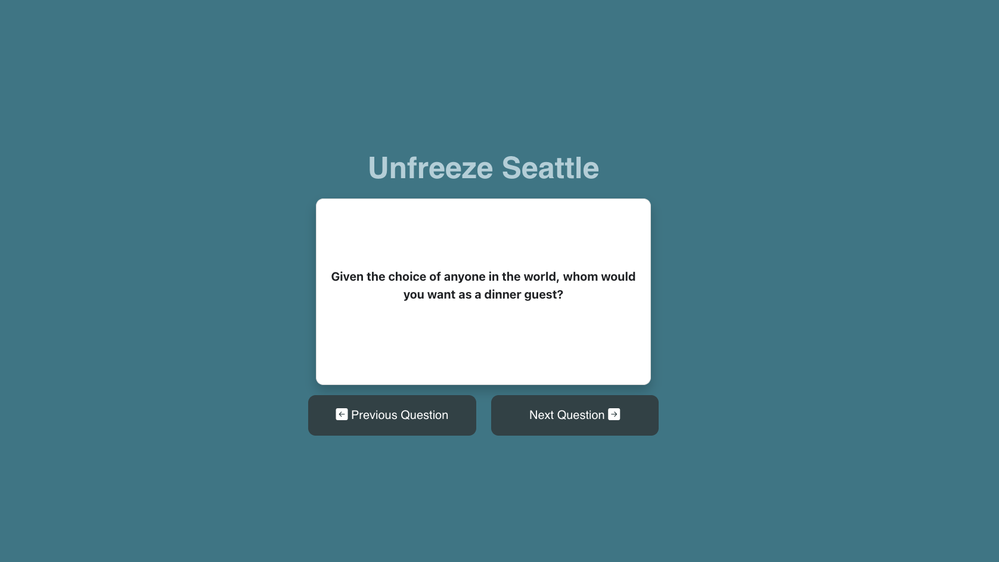

# Unfreeze Seattle

## Description
Unfreeze Seattle is a React webapp with an Express/Node backend. The webapp aims to offer notecards with various questions that can help you get to know your friends (and stragers) better.

The webapp was developed as a way to break the notorious Seattle Freeze.

## Features
- 30 "notecards" with deep questions that can be rotated through by clicking the "next" or "previous" buttons.
    - Notecards are loosely based on the "36 Questions That Lead to Love" which can be found [here](https://www.cosmopolitan.com/uk/love-sex/relationships/a32618/36-questions-fall-in-love/).

- Using React, the state of the notecard is modified on click, but the webpage is NOT refreshed.
- API endpoint in Express for the notecard data on `/notecards` to receive the notecard data, randomized, as it is appearing on the front end.
    - If you'd like to see the sorted data, you can navigate to `/notecards/sorted`.

## Installation
- Clone the repository to your local machine using `git clone` and the repository URL.
- Ensure you have Node.js installed on your machine. If not, you can download it [here](https://nodejs.org/en/download/).
- Open the file and navigate to the root directory of the repository.
- Please download the dependencies for the program using from the root directory by running: `cd server && npm install && cd ../client && npm install && npm run build`.
    - The `npm install`s will download the various dependencies needed to run the application.
    - The `npm run build` builds/compiles the React app to be served by the Express server.

## Usage
To run the application, navigate to `server/app.js`, and in the terminal, within the open file, run the command `node app.js` OR from the root directory run `npm start`.

The application, by default, will run on `localhost:3001`, if this port is currently being used on your machine, you can change the port on the `app.js` file. 

Once at the URL, you can click the "next" and "previous" buttons to cycle through the notecards.

## Technologies Used
- React
    - Notecard module.
    - Each Button module.
- Bootstrap
    - Iconography for the buttons (indicator arrows).
- CSS/HTML
    - Structure and styling for each module, as well as overall page styling.
- Express
    - Server side handling and serving of the React app.

## Example Screenshot
